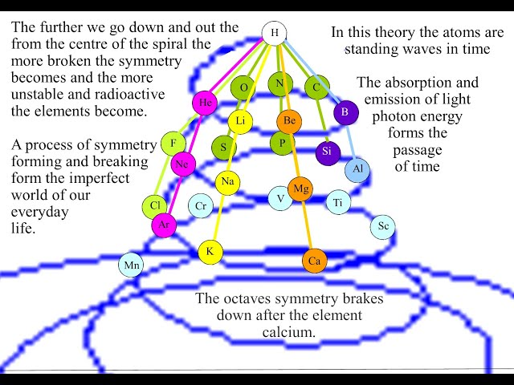

# Walter Russell Period Table

## Grok

<https://bquast.github.io/Walter-Russell-Periodic-Table/grok-spiral.html>

## Kimi

<https://bquast.github.io/Walter-Russell-Periodic-Table/kimi-spiral.html>

## GPT

<https://bquast.github.io/Walter-Russell-Periodic-Table/gpt5.5-spiral.html>

## Gemini

<https://bquast.github.io/Walter-Russell-Periodic-Table/walter-russell.html>

## Claude

<https://bquast.github.io/Walter-Russell-Periodic-Table/russell_periodic_spire_3d.html>

## Grok Explanation
[Grok explanation](https://grok.com/share/c2hhcmQtMg_fa58189c-1120-482d-a03e-00b193f06de6):

Walter Russell's periodic table (first published in 1926 in his book The Universal One) is a spiral arrangement of the elements that treats the periodic table as a dynamic, wave-based system rather than a static grid. It is "periodic" in a deeper, harmonic sense: the elements repeat their chemical and physical properties in rhythmic cycles called octaves, mirroring the structure of music where notes and their qualities recur at higher or lower frequencies.

### Spiral Structure and Octaves
Instead of straight rows and columns (as in the modern Mendeleev-style table), Russell's chart uses concentric spirals centered on a point of stillness (representing the cosmic "void" or balance). Elements emerge from this center through waves of compression (building density and matter) and then radiate outward through expansion (decay back toward energy).
The table divides into 9 or 10 octaves (Russell originally drew 10, later refined to 9 solid octaves plus a tenth). Each octave is a complete wave cycle:

* It begins and ends with inert (noble) gases — the points of perfect balance or "zero" where compression and radiation meet.
* Within each octave are seven principal tones (the main elements, analogous to the seven distinct notes in a musical scale: do-re-mi-fa-so-la-ti) plus mid-tones (transitional elements).
* Carbon sits at the exact center of the fourth octave as the point of maximum stability and balance.

This creates true periodicity because properties do not simply increase linearly with atomic number. Instead, they repeat harmonically every octave, just as a musical scale repeats its pattern of intervals when you go up or down an octave. Elements in corresponding positions across different octaves share similar vibrational "tones," chemical behaviors, and energy states — but at different scales of density or frequency.
The spiral visually shows matter as condensed light vibrating in and out of visibility: elements "rise" (integrate/compress) toward the midline of an octave and then "fall" (radiate/expand). This is why Russell could predict several undiscovered elements (marked with dotted stars on his original chart) — their positions in the wave cycles were already accounted for.

### Terrence Howard's Connection to Music Notes, Frequencies, and Octaves
Actor and polymath Terrence Howard revived and popularized Russell's chart in his 2024 Joe Rogan Experience appearance. Howard had independently been trying to redesign the periodic table based on wave curvature, frequencies, and musical principles (he argues nature has no straight lines — everything is waves and curves). He discovered Russell had already mapped it perfectly decades earlier.
Howard's key insight (drawn directly from Russell but emphasized with specific frequencies and colors) is that elements correspond to musical notes across octaves:

* In music, an octave doubles (or halves) the frequency of a note, making it sound like the "same" note but at a higher or lower pitch. Howard applies this exactly to the elements.
* Hydrogen and Carbon (and later Silicon, Cobalt, Rhodium, etc.) are the same tone ("key of E") but in different octaves.
** Hydrogen resonates at 40.5 Hz (yellow on the color spectrum in Russell's system).
** Carbon is at 81 Hz — exactly double, the next octave higher — yet still on the same underlying wave.
* These elements also show the same color when viewed through a spectrometer, revealing they are harmonic "echoes" of one another.
* Howard points out that the standard grid hides these relationships (e.g., Hydrogen sits isolated on the left, while Carbon is far away in the middle). Russell's spiral places them in aligned positions within their respective octaves, showing they share the same vibrational "key."

In short: the periodicity is musical and wave-like. Elements do not just repeat properties every 8 or 18 atomic numbers (as in the modern table); they recur as harmonic tones in successive octaves of increasing frequency/density. Higher octaves contain more complex, denser elements, but the underlying "notes" and relationships remain the same.

### Why This Makes the Table "Actually Periodic"
* Modern table: Periodicity is based on electron shell filling → chemical properties repeat in rows/periods.
* Russell/Howard view: Periodicity is based on universal wave mechanics and octaves → everything is light vibrating at specific frequencies. The spiral reveals the continuous evolution of matter through rhythmic cycles of creation and dissolution, exactly like a musical score played across multiple octaves.

Russell's chart is therefore not just a list — it is a map of cosmic harmony, where the universe itself is a symphony of frequencies, and the elements are the notes. Howard stresses that recognizing this allows new understandings of material engineering, transmutation, and even reality itself (via wave conjugation and pressure dynamics).

Here are visual examples of Russell's spiral octave chart (the classic 1926 version and modern interpretations showing the wave structure):

